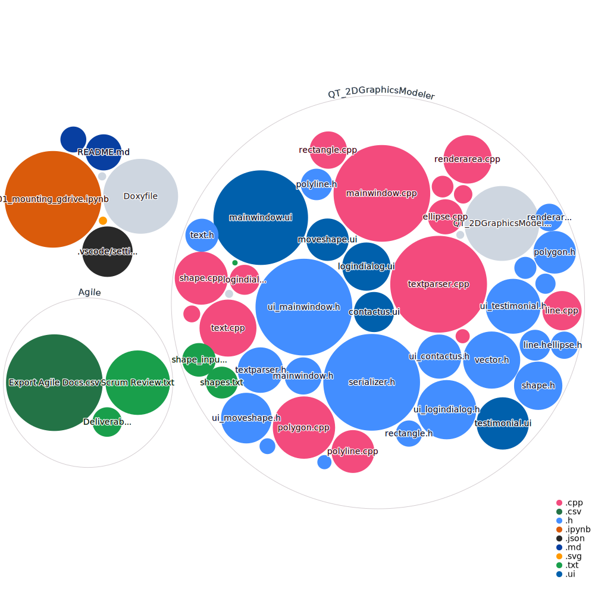

# TEAM NAME : Shapes R Us
# 2D-Graphics-Modeler

A 2D graphic object modeling software for the fictional company 2D Graphics Modeler Inc. This is a 2D graphics rendering library 
that can be integrated into an existing software suite.

## Visualization of Code Files

## Important Documents & Resources used for this project:

### [2D Graphics Modeler Class Project.pdf](https://github.com/campjake/2D-Graphics-Modeler/files/9841670/2D.Graphics.Modeler.Class.Project.1.pdf)

### [Intro Doxygen.pdf](https://github.com/campjake/2D-Graphics-Modeler/files/9841681/Intro.Doxygen.1.pdf)

### [Intro Qt Creator.pdf](https://github.com/campjake/2D-Graphics-Modeler/files/9841682/Intro.Qt.Creator.1.pdf)

### [Getting Started on GitHub](https://guides.github.com/activities/hello-world/)

### [Unit Testing with Google Primer](https://google.github.io/googletest/primer.html)

### [Git Cheat Sheat](https://training.github.com/downloads/github-git-cheat-sheet.pdf)

## Progress on Deliverables
- [x] Uses Qt
- [x] Uses GIT/Github
- [x] Uses Doxygen
- [x] Base class definition
- [x] Base class member function definitions
- [x] Derived class definitions
- [x] Derived class implementation
- [x] Vector class definition
- [x] Vector class implementation
- [x] Text class definition
- [x] Text class member function definitions
- [ ] Shape Move setter (mutator) (admin only)
- [x] Read shape attributes from file (Text Parser)
- [x] Objects print
- [ ] Add/Remove Objects
- [ ] Shape List Report
- [ ] Save changes between executions
- [x] Contact Us Method
- [x] Testimonials
- [x] Passes valgrind memory check
- [x] Extra Credit: Uses Agile Planning tools (Projects, Issues & Actions)
- [x] Extra Credit: Sort using STL Architecture

## Project Group Members
### Sprint 1
- Davis Ramirez
  - Role: Team

- Dylan Earl
  - Role: Team

- Fuli Gan  (Asuna)
  - Role: Team

- Hardin Liu
  - Role: Team
  
- Harshil Shahi
  - Role: Team

- Jacob Campbell
  - Role: Scrum Master

- Lawrence Tep
  - Role: Team

- Matthew Chin
  - Role: Product Owner
  

